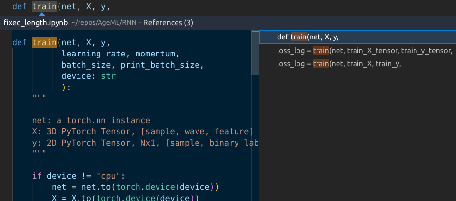
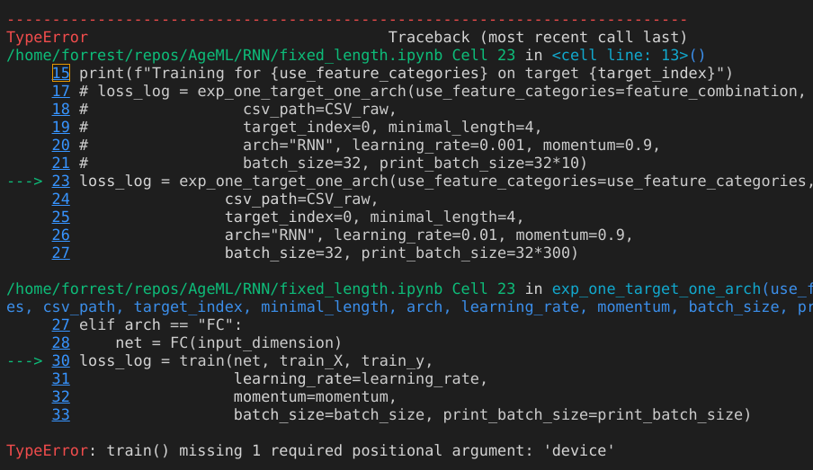

Jupyter is cool. It takes advantage of scripting or interpretting that variables, functions, and types/classes that you defined will remain in the memory for you to access handily. Jupyter wraps a notebook layer for that experience. 

However, when it comes to debugging, it's not that fun.  

## Blindly jumpping between definitions and references/calls

Jumping between a function's definition and references/calls is a common operation in debugging code. But this is done horribly in Jupyter. Here I am talking about the VSCode's Jupyter extension, not the vanilla Jupyter, which does not even support code analysis. 

This common feature is challenging in Jupyter because it has no files. 
Without the files, it becomes very hard to see the context. 
If there are multiple references, you cannot distinguish them. 
Without distinguishing them, you don't know which one to jump to. 
In the screenshot below, the two calls to the function `train` look the same in the thumbnail. 
Even if you just come to the definition of `train` from one of them, you don't even know from which one you come to here, or to go back to. 

## Tracking in Cell IDs 

Jupyter replaces the concept of files with cells. 
So a line of code is identified by the Cell ID and then the line number. 

But how do you search for a cell using its ID? And quickly jump to it and come back? 

I haven't found a way in the Jupyter extension of VSCode to jump to a Cell based on the unique ID. Because cells are not hierarchical, finding one using the ID is like finding a number in a pile of numbers.

I am actually not quite sure how the Cell ID counter works. Are Cell IDs monotonically increasing top down? If not, using ID to find cells is even more painful. You have to visually search all cells using your eyes. 

## Too many scrollings in tracing bugs

Traditional, file-based IDEs support opening multiple editor windows for different files, or the same file at different lines. 
But in Jupyter, you have only one. 

Having only one view means that you cannot see the traceback printout (see screenshot above), which is attached to one cell, and any function call along it on the same screen. You have to manual localize and come back to the traceback printout again and again. 

Of course you can workaround it by openning multiple copies of the same notebook and manually scrolling to the designated locations. This is not done automatically: you click a link in the tracaback and are brought to the line mentioned in another window. 

## Mixed debugging with imported modules 

Things become more complicated when debugging involves modules imported into a notebook. 
An imported module cannot be modified and tested in the REPL way. 
REPL requires definitions needed to run a code to remain in the RAM. 
Hence, in Jupyter everything is global. 
But if the member functions of a module imported have local variables, then passing values becomes challenging. 

## Conclusion

The shift from traditional, file-based development to Jupyter's cell-based one poses challenges for debugging, which is a key step in software development. 
We need solutions. 

