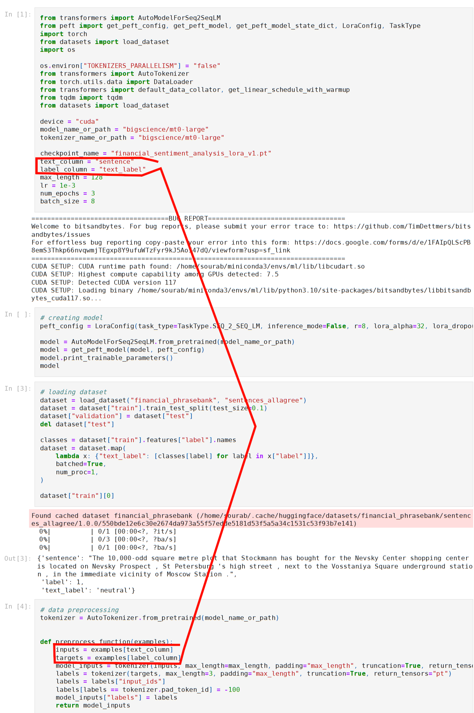
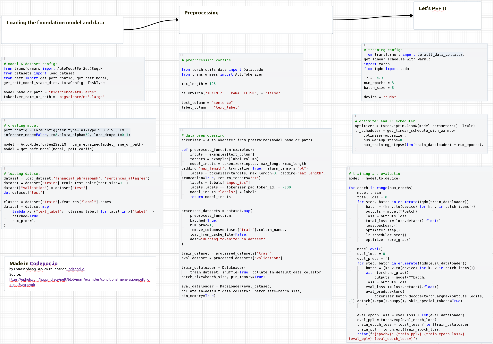

(This is the first post of my series of thoughts on the limitations of Jupyter notebooks, the tool that every AI/ML/Data person uses.)

The No.1 issue I have with Jupyter is that two semantically related pieces of code are usually spatially very far from each other. As a result, I have to scroll up and down frequently to connect the dots. 

[Here is an example](https://github.com/huggingface/peft/blob/main/examples/conditional_generation/peft_lora_seq2seq.ipynb) from HuggingFace's `peft` library. 

The global variables `text_column` and `label_column` are defined at the top of the notebook, but they are used nearly 70 lines later. When I saw their use, I had to scroll up to find out what they are. When I am done getting their meaning, I had to scroll down to continue reading the code.

Because execution results are mixed with code, two code blocks are more separated than in conventional code editors.

When I code in Jupyter, I spend a lot of time scrolling up and down. And there seems to be no way to for me to precisely jump to a line of code.

# A solution: Codepod
However, with [Codepod.io](Codepod.io) this can be solved. Codepod allows you to place code blocks on a canvas just like in Powerpoint or Miro. The screenshot below shows how the same code can be organized nicely in Codepod. [Click here](https://app.codepod.io/repo/v9zybr3z5crinrim5iv9) to see the "pod" live! 

# Related work (to be expanded)

Despite its dominance in AI/ML/DS, Jupyter has great limitations that have been well discussed in literature, including 
* [Microsoft CHI'19 paper, Managing Messes in Computational Notebooks](https://www.microsoft.com/en-us/research/uploads/prod/2019/01/Managing_Exploratory_Messes_in_Computational_Notebooks-2.pdf)
* [Amazon's 2023 Blog, Bringing code analysis tools to Jupyter notebooks](https://www.amazon.science/blog/bringing-code-analysis-tools-to-jupyter-notebooks)

