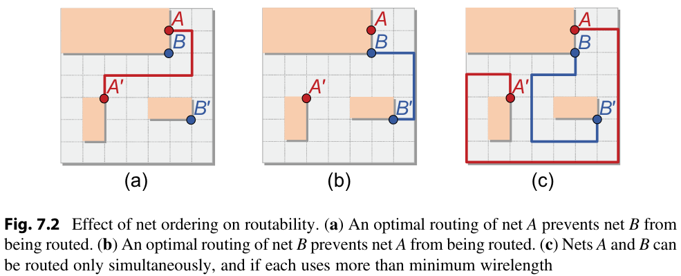

Routing is a problem in EDA. It is more challenging than path finding in other domains, such as robotics, in that paths cannot intersect in circuit routing -- so a greedy, optiomal path can make a solution globally suboptimal or even invalid. An example is given below (from Kahng et al., VLSI Physical Design, 2nd edition, 2022)

# Our efforts
* Heatmap Router: An encoder-decoder approach to PCB routing, MS Report, Zachary Johnson, 2022
* [Circuit Routing Using Monte Carlo Tree Search and Deep Neural Networks, arXiv](https://arxiv.org/abs/2006.13607)
* [Circuit Routing Using Monte Carlo Tree Search and Deep Reinforcement Learning, 2022 IEEE VLSI-DAT](./publications/Circuit_Routing_Using_Monte_Carlo_Tree_Search_and_Deep_Reinforcement_Learning_VLSI_DAT_2022.pdf)

# Recent, important papers 
## On Using ML for routing (unfortunately, none of them made to top EDA/AI conferences.)
* [Yihao Zhang, DEEP REINFORCEMENT LEARNING ON 1-LAYER CIRCUIT ROUTING PROBLEM, MS Thesis, UIUC, 2018](https://www.ideals.illinois.edu/bitstream/handle/2142/102796/ZHANG-THESIS-2018.pdf)
* [A Deep Reinforcement Learning Approach for Global Routing, CMU ME, 2019, which is like the first paper on using Reinforcement Learning for circuit routing](https://arxiv.org/abs/1906.08809)
* [ATTENTION ROUTING: TRACK-ASSIGNMENT DETAILED ROUTING USING ATTENTION-BASED REINFORCEMENT LEARNING, 2020](https://arxiv.org/pdf/2004.09473.pdf)
* [Track-Assignment Detailed Routing Using Attention-based Policy Model With Supervision](http://vdel.me.cmu.edu/vdelresource/publications/2020haiguangliaomlcad/paper.pdf)
* [Ranking Cost, arXiv, 2021](https://arxiv.org/pdf/2110.03939.pdf),  [Reviews for this paper](https://openreview.net/forum?id=uQnJqzkhrmj) in ICLR 2021 are worth reading. It was rejected. 

## On more conventional approaches (from top EDA confs.)
* [A Unified Printed Circuit Board Routing Algorithm With Complicated Constraints and Differential Pairs, ASP-DAC 2021](https://dl.acm.org/doi/pdf/10.1145/3394885.3431568)
* [A Complete PCB Routing Methodology with Concurrent Hierarchical Routing, DAC 2021](https://ieeexplore.ieee.org/stamp/stamp.jsp?tp=&arnumber=9586143)

# Routers
* [FreeRouting, the de facto open source router](https://github.com/freerouting/freerouting)
* [DeepPCB](https://www.deeppcb.ai/)

# Tutorials
* [Advances in PCB Routing](http://www.sliponline.org/SLIP10/presentations/3-1.pdf)

# Books
* [Kahng et al., VLSI Physical Design, 1st edition, 2011](https://theswissbay.ch/pdf/Gentoomen%20Library/Misc/Springer%20-%20VLSI%20Physical%20Design.pdf)
* [Kahng et al., VLSI Physical Design, 2nd edition, 2022](https://link.springer.com/book/10.1007/978-90-481-9591-6)
* [Alpert et al., Handbook of Algorithms for Physical Design Automation, 2009](https://doc.lagout.org/science/0_Computer%20Science/2_Algorithms/Handbook%20of%20Algorithms%20for%20Physical%20Automation%20%5BAlpert%2C%20Mehta%20%26%20Sapatnekar%202008-11-12%5D.pdf)

# Figures
* [Dr. Chung-Kuan Cheng, UCSD](https://cseweb.ucsd.edu/~kuan/)
* Dr. Yi-Lang Li, National Chiao Tung University, Taiwan
* [Haiguang Liao, CMU](https://scholar.google.com/citations?user=tO4LYKIAAAAJ&hl=en)

# Open source projects 
* [Google Circuit Training](https://github.com/google-research/circuit_training) This project is more on placement than training
* [OpenROAD PCB Router, UCSD](https://github.com/The-OpenROAD-Project/PcbRouter)

